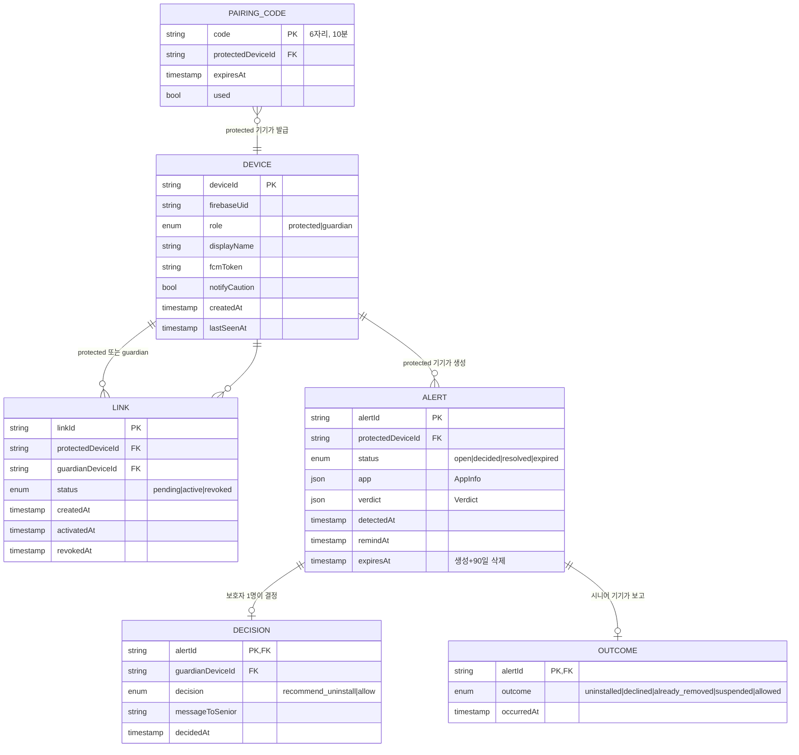
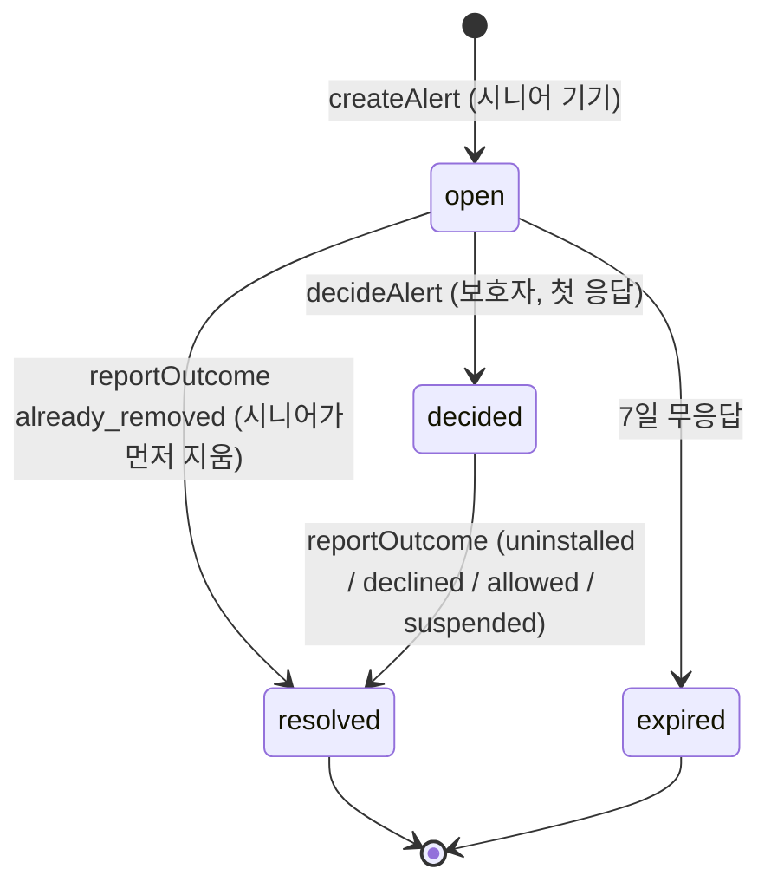

# 데이터 모델

- 로컬(Room, 시니어·보호자 기기)과 서버(저장소는 ADR-0001에서 결정)로 나눔
- **로컬에만 있는 것**: 설치 앱 스냅샷, 모든 판정 기록 → 서버로 안 감 (constitution III)
- API 표현은 [contracts/openapi.yaml](contracts/openapi.yaml)

## 1. 관계도

## 2. 서버 개체 규칙

| 개체 | 불변 조건 | 삭제 |
|---|---|---|
| Device | `firebaseUid`당 1개. 역할은 바꿀 수 없음 (바꾸려면 앱 데이터 초기화) | 기기 삭제 API 또는 마지막 접속 180일 후 |
| Link | (protected, guardian) 쌍당 active 1개. 보호자는 최대 3명 (무료 1명, 🔶 구독 시 3명) | revoked 즉시 해당 링크로 만든 요청 데이터 삭제 |
| PairingCode | 기기당 유효 코드 1개. 수락되면 `used` | 만료 1시간 후 |
| Alert | (protectedDevice, packageName, signingCertSha256, versionCode)당 open 1개 | 생성 90일 후 (NFR-09) |
| Decision | Alert당 1개 — **먼저 쓴 쪽만 성공** (트랜잭션 조건: `status == open`) | Alert와 같이 |

### Alert 상태 전이

- `declined`(시니어가 시스템 창에서 취소)도 resolved로 닫고, 시니어 기기 로컬에서 하루 뒤 재안내 (서버 상태는 그대로)

## 3. 로컬 DB (Room) — 시니어 기기

| 테이블 | 주요 열 | 용도 |
|---|---|---|
| `installed_app` | packageName PK, label, versionCode, signingCertSha256, installSource, firstInstallTime, lastUpdateTime, isSystem, lastScannedAt | 현재 설치 앱 스냅샷 |
| `verdict` | id PK, packageName, versionCode, level, score, modelVersion, featureSchemaVersion, reasonsJson, latencyMs, createdAt | **모든 판정 기록** (constitution VII — 실험 로그 겸용) |
| `allow_entry` | (packageName, signingCertSha256, versionCode) PK, allowedBy, createdAt | 보호자가 허용한 앱. 같은 버전은 다시 안 물음 |
| `alert_local` | alertId PK, packageName, status, decision, guardianName, messageToSenior, outcome, nextNudgeAt | 서버 요청의 로컬 사본 + 재안내 일정 |
| `outbox` | id PK, method, path, bodyJson, idempotencyKey, attempts, nextAttemptAt | 오프라인 중 쌓인 서버 호출 (WorkManager가 재전송) |
| `package_change_cursor` | id=1, sequenceNumber, bootCount | `getChangedPackages` 순번 |

## 4. 로컬 DB — 보호자 기기

| 테이블 | 주요 열 | 용도 |
|---|---|---|
| `link_cache` | linkId PK, protectedName, status, lastSeenAt | 홈 화면 |
| `alert_cache` | alertId PK, linkId, appLabel, iconPng, level, reasonsJson, status, decisionJson, outcomeJson, updatedAt | 요청 목록·상세 (오프라인 열람) |

## 5. 설정 (DataStore)

| 키 | 기기 | 기본값 |
|---|---|---|
| `role` | 공통 | 온보딩에서 선택 |
| `onboardingDone` | 공통 | false |
| `disclosureAcceptedVersion` | 시니어 | 0 (고지 문구가 바뀌면 다시 받음) |
| `usageAccessGranted` | 시니어 | false |
| `falsePositiveFeedback` | 공통 | true (US7, 끌 수 있음) |
| `strongModeEnabled` | 시니어 | false (Device Owner일 때만 노출) |
| `seniorTextScale` | 시니어 | 1.0 (시스템 글꼴 배율에 곱하는 추가 배율, 1.0~1.3) |
