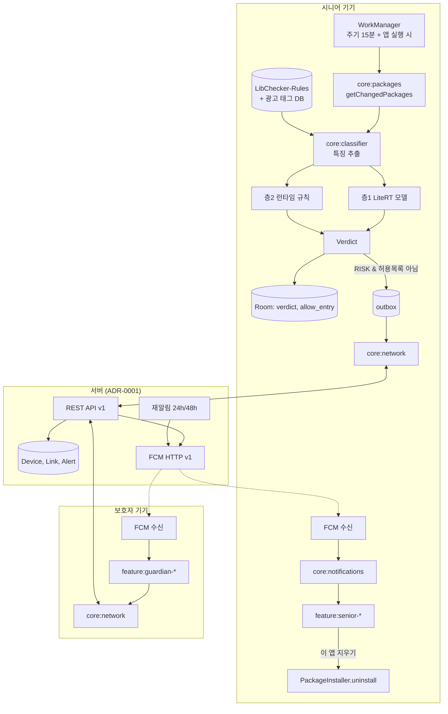

# 구현 계획 (Plan): 폰주치의 MVP

- **날짜**: 2026-10-03 · **Spec**: [spec.md](spec.md)
- 형식: spec-kit `plan-template.md`

## 요약

- 시니어 기기에서 **설치 변화 감지 → 특징 추출 → 2층 판정(LiteRT 모델 + 공개 규칙)** 을 오프라인으로 수행
- "위험"만 서버로 보내 보호자 승인 → 시니어가 시스템 삭제 확인창에서 삭제
- 앱은 현재 뼈대(Now in Android 구조)를 확장, 서버·학습 파이프라인은 같은 저장소의 별도 폴더

## 기술 맥락

| 항목 | 값 |
|---|---|
| 언어 | Kotlin 2.3 (앱), Python 3.11 (학습), 서버는 ADR-0001 |
| 주요 의존성 | Jetpack Compose·Material 3, Hilt, Room, DataStore, WorkManager, Navigation 3, LiteRT, Firebase(Auth·Messaging·App Check), Retrofit/OkHttp + kotlinx.serialization |
| 저장 | Room (로컬), 서버 저장소는 ADR-0001 |
| 테스트 | JUnit4, Turbine, Compose UI Test, Roborazzi(스크린샷), Microbenchmark, openapi 계약 테스트 |
| 대상 | Android 8.0(API 26)~16+, targetSdk 36 |
| 성능 목표 | 판정 p95 ≤ 200ms, 감지 p95 ≤ 30분, 모델 ≤ 20MB |
| 제약 | 접근성 서비스·포그라운드 서비스·VPN 미사용, 위험 건만 전송 |

## 원칙 점검 (constitution)

| 원칙 | 점검 | 결과 |
|---|---|---|
| I 오탐 최소 | 임계값을 FPR 5%로 고정, 허용 목록 | ✅ |
| II 승인 경계 | 삭제는 시스템 확인창, 강력 모드도 정지까지만 | ✅ |
| III 데이터 최소화 | `POST /alerts`에 앱 1개 정보만, 목록 API 없음 | ✅ |
| IV 온디바이스 | 판정 경로에 네트워크 없음 | ✅ |
| V 정책 | 접근성 서비스 미사용, 상시 알림 채널 | ✅ |
| VI 접근성 | ux-flows §5·§7 | ✅ (구현 시 테스트) |
| VII 측정 | `verdict` 테이블에 전부 기록 | ✅ |
| VIII 구조 | NiA 모듈 관례 | ✅ — 예외는 아래 표 |

## 아키텍처



### 설치 감지 설계 (FR-002)

| 방법 | 언제 | 비고 |
|---|---|---|
| `PackageManager.getChangedPackages(seq)` | WorkManager 주기 작업(15분), 앱 실행, 부팅 후 | API 26+. 순번은 재부팅 시 초기화 → `bootCount`와 같이 저장, 바뀌면 전체 재검사 |
| `ACTION_PACKAGE_ADDED`·`REPLACED` 동적 리시버 | 앱 프로세스가 살아 있을 때 | 매니페스트 등록은 Android 8부터 전달 안 됨 |
| 포그라운드 서비스 | **안 씀** | `specialUse` 선언·심사 부담, 상시 알림 강제, 배터리 |

- 결과: 감지 지연 p95 ≤ 30분 (NFR-02). 즉시 감지가 필요하면 강력 모드(Device Owner)의 설치 출처 차단으로 대체

### 삭제 유도 (FR-030)

- `REQUEST_DELETE_PACKAGES` 권한 + `PackageInstaller.uninstall(VersionedPackage, IntentSender)` → 시스템 확인창
- 결과는 `IntentSender` 콜백의 `EXTRA_STATUS`로 받아 `outcome` 보고
- 반드시 앱이 화면 앞에 있을 때 호출 (백그라운드 액티비티 실행 제한)

## 저장소 구조

```text
phonedoctor/
├── .specify/memory/constitution.md
├── specs/001-mvp/            # 이 문서들
├── docs/adr/                 # 결정 기록
├── app/                      # (ADR-0002 B면 app-senior/, app-guardian/)
├── build-logic/              # 컨벤션 플러그인 (현재 8종)
├── core/
│   ├── model/                # NEW  Verdict, RiskLevel, ReasonCode, AppInfo (순수 Kotlin)
│   ├── common/               # NEW  디스패처, Result
│   ├── data/                 # 있음  저장소 계층
│   ├── data-test/            # 있음
│   ├── database/             # 있음  Room 엔티티를 data-model.md §3·4로 교체
│   ├── datastore/            # NEW  설정 (data-model.md §5)
│   ├── network/              # NEW  openapi 클라이언트, 인증 인터셉터, outbox 전송
│   ├── notifications/        # NEW  채널 4종, FCM 서비스
│   ├── packages/             # NEW  설치 앱 읽기·변화 감지 (PackageManager 래퍼)  ※NiA에 없음
│   ├── classifier/           # NEW  특징 추출 + LiteRT 실행 + 층2 규칙      ※NiA에 없음
│   ├── designsystem/         # 있음  시니어·보호자 테마 2종
│   ├── ui/                   # NEW  공용 컴포저블 (앱 카드, 근거 목록)
│   └── testing/              # 있음
├── feature/
│   ├── appscan/              # 있음  → senior-home으로 이름 변경
│   ├── onboarding/{api,impl}
│   ├── senior-home/{api,impl}
│   ├── senior-appdetail/{api,impl}
│   ├── pairing/{api,impl}
│   ├── guardian-home/{api,impl}
│   ├── guardian-alert/{api,impl}
│   └── settings/{api,impl}
├── sync/work/                # NEW  WorkManager 작업 (NiA sync:work 관례)
├── ml/                       # NEW  Python 학습 파이프라인 (Gradle 밖)
│   ├── schema/feature_schema_v1.json
│   ├── extract/  train/  eval/  export/
│   └── rules/runtime_bonus.yaml
└── server/                   # NEW  ADR-0001 결과
```

- 모듈 이름은 NiA 관례(`core:*`, `feature:*/{api,impl}`, `sync:work`)를 따름
- 테스트용 광고 앱 APK 생성기: `testapps/`(🔶 P1) — 광고 SDK·숨김 아이콘·오버레이 권한을 조합한 가짜 앱을 빌드해 시연·일치 테스트에 사용

## 학습 파이프라인 (`ml/`)

| 단계 | 도구 | 산출물 |
|---|---|---|
| 데이터 | MH-1M(Figshare npz) 권한·인텐트 부분, CIC-AAGM2017, KronoDroid, 직접 수집 APK | `data/` (git 제외) |
| 추출 | androguard 4.1.4 고정 / apk-info (변조 APK) | 특징 parquet (스키마 v1) |
| 학습 | scikit-learn·LightGBM 베이스라인 → (Q4) MLP | 모델 + 학습 로그 |
| 임계값 | 검증셋 FPR 5% 지점 | `thresholds.json` |
| 변환 | LiteRT 변환 + ai-edge-quantizer INT8 | `.tflite` ≤ 20MB |
| 평가 | 별도 테스트셋 + 대조군(시티즌코난·Play Protect 수동 실행) | 비교표 |

- ⚠️ MH-1M에는 컴포넌트 정보가 없어 **광고 SDK 특징은 직접 수집 APK에서만** 학습됨 → 수집 목표: 광고·회색지대 앱 300개 이상 + 시니어가 실제로 쓰는 정상 앱 300개 이상 🔶
- 실험마다 `ml/runs/{날짜}_{이름}/`에 파라미터·환경·지표 저장 (constitution VII)

## 테스트 전략

| 층 | 대상 | 방법 |
|---|---|---|
| 단위 | 특징 추출, 층2 규칙, 임계값, 조사 처리 | JUnit, 가짜 PackageManager |
| 일치 | 기기 추출기 vs androguard | contracts/classifier.md §5 |
| 계약 | 서버 응답이 openapi와 일치 | 서버 테스트에서 스키마 검증 |
| UI | 시니어 화면 글꼴 200% | Compose UI Test, Roborazzi 스크린샷 |
| 성능 | 판정 지연 | Microbenchmark (실기기) |
| 종단 | F1 전체 | 에뮬레이터 2대 + 테스트 광고 앱 (quickstart.md) |

## 예외 기록 (Complexity Tracking)

| 원칙과 다른 점 | 필요한 이유 | 더 단순한 안을 안 쓴 이유 |
|---|---|---|
| NiA에 없는 `core:packages`, `core:classifier` | 이 앱의 핵심 도메인 | `core:data`에 넣으면 PackageManager·LiteRT 의존이 저장소 계층에 섞임 |
| 저장소 안에 `ml/`, `server/` | 특징 스키마 파일을 앱과 학습이 공유 | 저장소를 나누면 스키마 동기화가 수동이 됨 |
