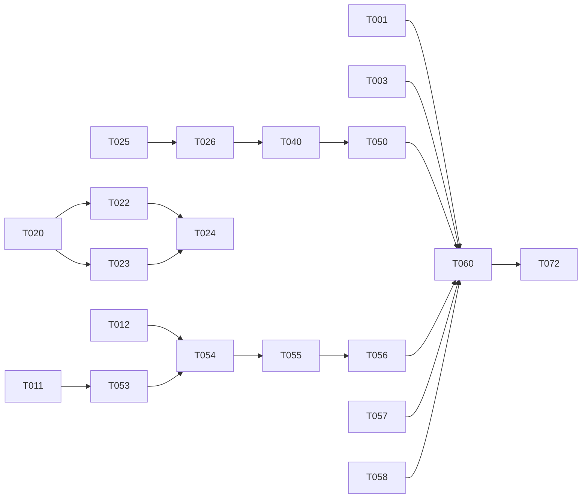

# 작업 목록 · 우선순위 (Tasks)

- 작성 2026-10-03 · 형식: spec-kit `tasks-template.md` (`[P]` = 다른 작업과 동시 진행 가능, `[USn]` = 관련 사용자 시나리오)
- 일정 기준: 추진계획서 2-4 + 중간고사 8주차(10/19~23, ML 10/20·TOPICS 10/21)

## 우선순위를 정한 기준

1. **남이 처리해 줘야 끝나는 일(대기 시간)을 먼저** — 계정 인증, 교수님 서약, 테스터 모집은 내가 빨리 해도 줄어들지 않음
2. **다른 작업을 막는 결정을 다음으로** — ADR 2개가 정해져야 서버·앱 모듈 작업 시작 가능
3. **계획서 일정의 주차 산출물** — 6~7주차 "데이터셋", 9~10주차 "온디바이스 모델", 11주차 "원스토어 배포본"
4. 마감이 고정된 외부 일정: **11/9(월) Play 비공개 테스트 개시**(테스터 12명 × 14일 + 심사 3~14일)

## 단계 0 — 이번 주말~10/6 (외부 대기 시작)

- [ ] T001 [P] Google Play 개발자 계정 등록($25) + 본인 인증 시작 — 인증에 며칠 걸림, App Check·Integrity 연결도 이것에 의존
- [ ] T002 [P] 원스토어 개발자 계정 등록 (무료)
- [ ] T003 [P] 비공개 테스터 12명 이상 모집 시작 — Google 그룹 생성, 지인·수강생에게 안내. **11/9부터 14일 연속 참여** 조건 미리 고지
- [ ] T004 [P] AndroZoo 접근용 교수님 서약 요청 메일
- [x] T005 [P] MH-1M Figshare npz 다운로드(`~/data/mh1m`, md5 검증) + 라벨표 `ml/data_prep/mh1m_labels.py` → `ml/data/mh1m/labels.csv.gz` (2026-10-03)
  - npz 메타데이터에 VT 추천 위협 라벨이 있어 **Dataverse 라벨 12.3GB 불필요**. adware 58,067개(dowgin·kuguo·revmob·airpush 등 중국·구형 광고 SDK 위주, hiddenad 496) / 전체 악성 119,094 / 정상 1,221,421
  - inner npz 특징 11,961개 중 기기에서 뽑을 수 있는 건 **권한 166 + 인텐트 250**뿐(나머지 API 호출 11,545) → T020 스키마 어휘의 출발점
- [ ] T006 [P] 할머니 폰 광고 원인 확인 (spec Q1) — 설치 앱 목록 + Chrome 사이트 알림 설정 화면 사진. 결과에 따라 FR-040 우선순위 조정

## 단계 1 — 결정 (막힘 해소)

- [ ] T010 spec.md 검토 — 사용자 시나리오 우선순위·비목표 확인
- [x] T011 ADR-0001 서버 방식 선택 → **B: Ktor + Cloud Run + Neon** (2026-10-03)
- [x] T012 ADR-0002 보호자 앱 형태 선택 → **A: 한 앱 + 역할 선택** (2026-10-03)
- [ ] T013 첫 git 커밋 (현재 스테이징만 된 상태) — 커밋 시점은 본인이 지정

## 단계 2 — 6~7주차 10/5~10/16 · 계획서 산출물 "데이터셋"

데이터·특징 (US1의 기반)
- [x] T020 특징 스키마 v1 `ml/schema/feature_schema_v1.json` — **권한 121·인텐트 필터 91 확정**(2026-10-03, MH-1M 보유율 기준), 광고 SDK·이름 키워드 21개(2026-10-06)
  - 데이터: `ml/data_prep/mh1m_static.py` → `ml/data/mh1m/static.npz`(134만×416, 26초) + `vocab_stats.csv`
  - ⚠️ 계약 변경: 기기 인텐트 추출을 receiver 조회 → **매니페스트 직접 파싱**으로 (classifier.md §2)
- [x] T021 [P] 광고 SDK 태그 `ml/rules/ad_sdk_tags.csv` — 플래그 12종 + 개수용 11종, 접두어 대조, 최신 AAR 18종 매니페스트로 확인 (2026-10-06)
- [x] T022 [P] PC 특징 추출기 `ml/extract/extract.py` (androguard 4.1.4 고정) — 스키마 v1 열 233개, 받는 중·깨진 APK는 건너뜀 (2026-10-07)
- [ ] T023 [P] 기기 특징 추출기 `core/packages` + `core/classifier/feature` — PackageManager 래퍼 + **base.apk 매니페스트(바이너리 XML) 파서**
- [ ] T024 일치 테스트 (APK 20개, 비트 단위) — T022·T023 이후
- [ ] T025 [P] 직접 수집: 광고·회색지대 앱 + 시니어 정상 앱 (원스토어·Play 인기 "클리너·부스터·와이파이" 장르)
  - Play 후보 497개 `ml/collect/` (검색어 20개, 로그인 없이 공개 검색), apkeep + 익명 공용 계정으로 다운로드 진행 중 (2026-10-07). 라벨링·원스토어 전용 앱은 남음
- [ ] T026 **평가용 테스트셋 분리·동결** `ml/data/test_v1/` — 이후 학습에 절대 사용 안 함 (constitution VII)
- [ ] T027 대조군 측정 절차 문서화: 같은 테스트셋을 시티즌코난·Play Protect로 검사하는 방법·기록 양식

앱 뼈대 (병행)
- [ ] T030 [P] minSdk 23 → 26 `build-logic/.../KotlinAndroid.kt`
- [ ] T031 [P] `core:model` 생성 — Verdict·RiskLevel·ReasonCode·AppInfo
- [ ] T032 [P] Room 엔티티 교체 — data-model.md §3 (`installed_app`, `verdict`, `allow_entry`, `package_change_cursor`)
- [ ] T033 [US1] `sync:work` 변화 감지 작업 — getChangedPackages + bootCount

## 단계 3 — 8주차 10/19~23 (중간고사)

- [ ] T040 [US1] 베이스라인 학습 1회 (LightGBM) + 임계값 FPR 5% 지점 기록 → spec Q4 판단 자료
- 그 외 작업 없음 (시험 우선)

## 단계 4 — 9~10주차 10/26~11/6 · "온디바이스 모델" + 연결 흐름 앞당김

> 계획서는 승인 흐름·UI를 11주차에 두었지만, **11/9 비공개 테스트에 올릴 빌드**가 필요해 연결·승인 뼈대를 여기로 당김. 테스트 기간 중 업데이트는 가능

- [ ] T050 [US1] 모델 개선 + INT8 변환 + LiteRT 이식 `core/classifier/model`
- [ ] T051 [US1] 기기 지연 측정 Microbenchmark (NFR-01)
- [ ] T052 [US2] 첫 전체 검사 화면 (O-S3)
- [ ] T053 [P] 서버 구현 — ADR-0001 결과, openapi.yaml 경로 순서: devices → pairing → alerts
- [ ] T054 [P] [US3] 연결 흐름 (O-S4, O-G2, S3) — `feature/pairing`
- [ ] T055 [US4] 보호자 요청 상세·응답 (G1, G2) — `feature/guardian-*`
- [ ] T055a [US4] 연락 끊김 경고 (F6) — 서버 `lastSyncAt` 48시간 판정 + G1 경고 카드 + 보호자 알림 1회
- [ ] T056 [US5] 시니어 삭제 유도 (S2) + PackageInstaller.uninstall
- [ ] T057 [P] 개인정보처리방침 GitHub Pages — 스토어 등록 필수
- [ ] T058 [P] 공개 고지 화면 (O-S1, FR-041) + Data safety 신고 초안

## 단계 5 — 11주차 11/9~13 · 출시

- [ ] T060 **Play 비공개 테스트 개시 (11/9)** — 테스터 12명 옵트인 확인
- [ ] T061 원스토어 등록 신청
- [ ] T062 Play `QUERY_ALL_PACKAGES`·`isMonitoringTool` 선언 양식 작성
- [ ] T063 Play 정책 인사이트(android/skills)로 출시 전 정책 점검
- [ ] T064 [US6] 근거 문구 시니어·보호자 2종 적용

## 단계 6 — 12~13주차 · 검증·보고

- [ ] T070 대조군 비교 실험 (SC-001·SC-002)
- [ ] T071 사용성 관찰: 설치 대행자 3명 (SC-003), 시니어 1명 이상 (SC-004)
- [ ] T072 Play 심사 제출 (14일 테스트 종료 후, 11/23 전후)
- [ ] T073 최종보고서 (13주차, spec Q6 면제 여부 확인)

## 나중에 (P2·P3)

- [ ] T080 [US7] 오탐 익명 신고
- [ ] T081 [US8] 강력 모드 (testdpc 참고)
- [ ] T082 FR-042 AppFunctions — compileSdk 37 필요
- [ ] T083 [US6] Gemini Nano 문장 다듬기
- [ ] T084 [US9] 주간 리포트·구독

## 의존 관계

