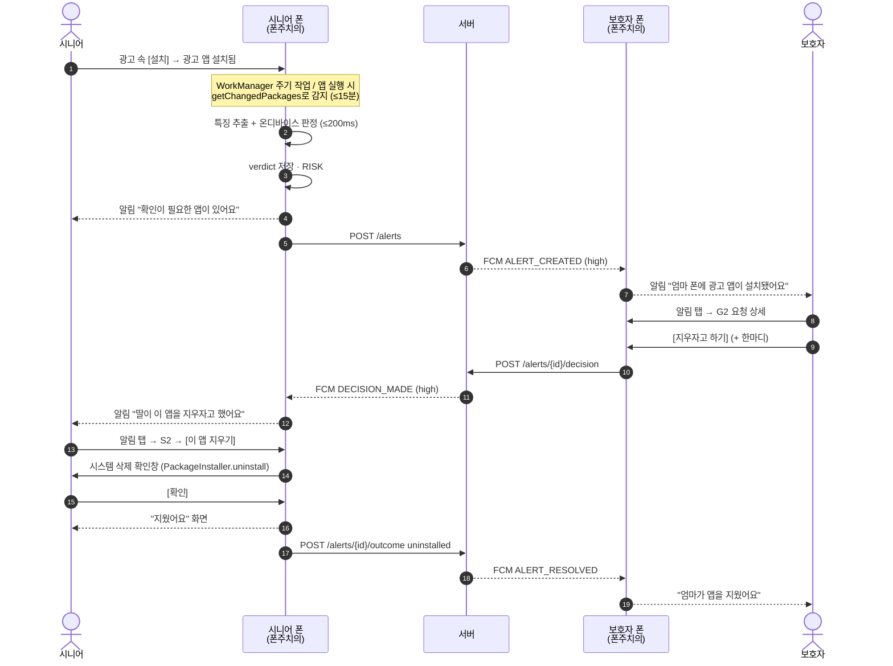
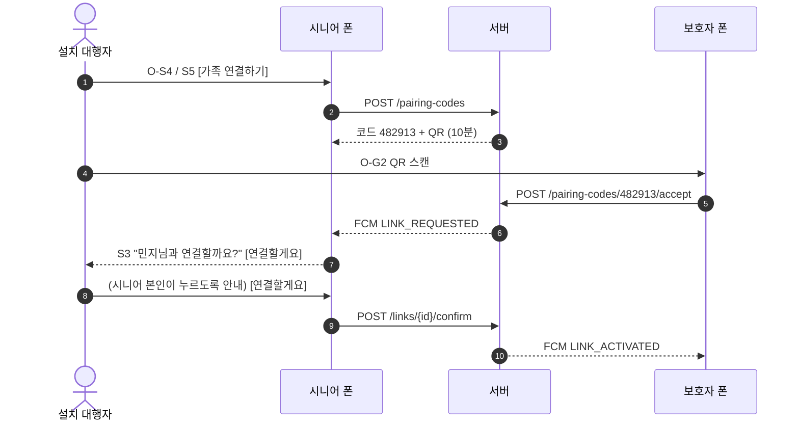
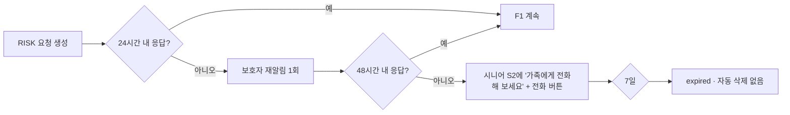
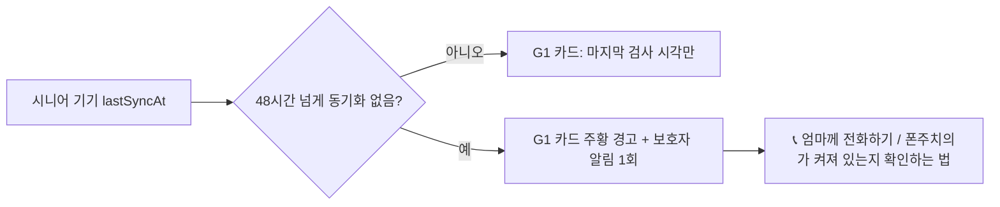

# UI/UX 흐름

- 대상: 시니어 기기(보호 대상) · 보호자 기기 · 설치 대행자(첫 설정)
- 근거·출처: [research.md](research.md) §3 디자인 기준
- 화면 ID 규칙: `S`=시니어, `G`=보호자, `O`=온보딩(공통)
- **Figma 시안(11화면, 2026-10-03)**: https://www.figma.com/design/UcNiV8MvfXp6NazfkBB5KG — 토큰 변수·텍스트 스타일·컴포넌트(시니어/보호자 버튼, 상태 원, 상태 칩) 포함.

---

## 1. 설계 원칙

| # | 원칙 | 적용 | 근거 |
|---|---|---|---|
| 1 | 한 화면, 주요 행동 1개 | 시니어 화면의 채운 버튼은 항상 1개. 나머지는 **테두리 버튼**(같은 높이, 글자만 있는 버튼 금지) | 서울시 고령층 접근성 표준 지침 2·3 (필수 요소, 단순한 구조) · 늘다 관찰: 시니어는 글자로 된 UI를 누를 수 있다고 인식하지 않음 [R1] |
| 2 | 전화로 설명할 수 있는 화면 | 색·위치·버튼 문구를 고정 ("아래쪽 빨간 버튼 누르세요"). 시니어 화면에서 **Dynamic Color 끔** | 보호자가 전화로 안내하는 상황 (페르소나) |
| 3 | 겁주지 않기 | "위험!", "해킹" 대신 "확인이 필요한 앱이 있어요". 결정은 권유형 | 토스 라이팅 원칙 6 (Suggest than force), 지침 10 (심리적 부담) |
| 4 | 되돌릴 수 있게 | 허용 → 나중에 다시 검사 가능, 연결 해제 → 다시 연결 가능, 삭제 전 시스템 확인창 | 지침 9 (오류 예방·복구) |
| 5 | 상태가 보이게 | 홈 맨 위에 상태 문장 1개 + 마지막 검사 시각 | 지침 5 (시스템 상태 가시성) |
| 6 | 시간 제한 없음 | 시니어 화면에 타이머·자동 닫힘 없음 (연결 코드 10분은 보호자 화면 쪽에서 재발급 유도) | 고령자 디자인 체크리스트(ISO 25556) 금지 항목 |
| 7 | 시스템 설정 존중 | 시스템 글꼴·글꼴 크기 그대로 사용(삼성 사용자 글꼴 포함), sp 단위, 200%에서 잘림 없음 | Android 14 비선형 글꼴 배율 최대 200% |
| 8 | 누르는 건 아래, 읽는 건 위 | 시니어 화면의 버튼은 화면 아래쪽에 고정. 위쪽은 상태 문장·설명 | 삼성 One UI 화면 구성(보기 영역/조작 영역), 엄지 닿는 범위 [R1] |
| 9 | 지금 몇 단계인지 | 온보딩 화면 맨 위에 "2/4" 대신 문장으로 "4단계 중 2단계" | 늘다 관찰: 어떤 단계에 있는지 인식하지 못함 [R1] |

## 2. 정보 구조 (IA)

```
폰주치의 (한 앱, 첫 실행에서 역할 선택 — ADR-0002 안 A 기준)
├─ O 온보딩 (공통)
│   ├─ O1 역할 선택: "이 폰을 지켜요" / "가족 폰을 지켜요"
│   └─ (역할별 분기)
│
├─ 시니어 모드
│   ├─ O-S1 무엇을 하는 앱인지 (공개 고지, FR-041)
│   ├─ O-S2 권한: 알림 → (선택) 사용 기록
│   ├─ O-S3 첫 전체 검사 (US2)
│   ├─ O-S4 가족 연결 코드·QR (US3)  ← 건너뛰기 가능
│   ├─ S1 홈
│   ├─ S2 앱 상세 · 삭제 유도 (US5)
│   ├─ S3 연결 확인 "○○님과 연결할까요?"
│   ├─ S4 검사 기록
│   ├─ S5 가족 연결 관리 (코드 다시 받기, 연결 끊기)
│   ├─ S6 광고 알림 끄는 법 (FR-040)
│   └─ S7 설정 (글자 크기 미리보기, 강력 모드, 데이터 지우기)
│
└─ 보호자 모드
    ├─ O-G1 Google 로그인
    ├─ O-G2 QR 스캔 / 6자리 입력
    ├─ O-G3 "부모님 폰에서 [연결할게요]를 눌러 주세요" 대기
    ├─ G1 홈 (연결된 부모님 카드 + 대기 중 요청 + 연락 끊김 경고, F6)
    ├─ G2 요청 상세 · 응답 (US4)
    ├─ G3 기록
    └─ G4 설정 (주의 단계도 받기, 연결 관리, 구독)
```

- 하단 탭 없음. 시니어 홈은 **스크롤 없는 한 화면**, 보호자 홈은 목록

## 3. 핵심 흐름

### F1. 설치 → 판정 → 승인 → 삭제 (주 흐름, 시연 시나리오)



- ⚠️ 백그라운드에서 삭제 창을 바로 띄우는 건 **Android 백그라운드 액티비티 실행 제한**으로 불가 → 반드시 **시니어가 알림을 탭**해서 앱이 앞으로 나온 뒤 띄움
- 보호자가 [괜찮은 앱이에요]를 누르면 13~19 대신: 시니어 폰 허용 목록 추가, 시니어 알림 없음(이미 뜬 알림은 "가족이 괜찮다고 했어요"로 교체)

### F2. 가족 연결



- 시니어 확인 단계는 정책 근거(시니어 본인 동의)이자 오연결 방지. 생략 불가

### F3. 보호자 무응답



### F4. 연결 끊기 (시니어)

S7 설정 → S5 가족 연결 → 이름 옆 [연결 끊기] → 확인창 "민지님과 연결을 끊을까요? 민지님은 더 이상 알림을 받지 않아요" [연결 끊기]/[그대로 두기] → `DELETE /links/{id}` → 완료 문구

### F5. 강력 모드 (P3, 시연 기기 전용)

공장 초기화 → 설정 마법사에서 화면 6번 탭 → QR 스캔(프로비저닝 페이로드) → 폰주치의가 Device Owner로 설치 → 이후 F1의 15번 단계에서 **승인 즉시 앱 정지**, 시니어 S2에는 "가족이 이 앱을 잠시 멈췄어요" + [이 앱 지우기]

### F6. 연락 끊김 (보호자에게 알림)

시니어 폰이 폰주치의를 지웠거나, 알림을 껐거나, 꺼져 있으면 보호자는 "아무 일 없음"과 "보호가 멈춤"을 구분할 수 없다. 오탐을 줄이려고 조용히 두는 설계라 더 필요하다.



- 기준 48시간: WorkManager 주기(≤15분)·Doze 지연을 넉넉히 넘는 값. 실측 후 조정
- 근거: 부모 통제 앱 사례의 "Monitoring gaps" 카드 [R2]
- 서버 쪽 판정이 필요함 → openapi `lastSyncAt` 기준 일일 배치 또는 조회 시 계산 (tasks.md에 추가 필요)

## 4. 화면 와이어프레임 (ASCII, 360dp 폭 기준)

> 레이아웃 가설 확인용. humbleteam/ascii-wireframes 방식(구현 전 텍스트 스케치)

### S1 시니어 홈 — 정상

```
┌──────────────────────────────┐
│ 폰주치의               ⚙ 설정 │  ← 상단바 64dp, 설정은 아이콘+글자
├──────────────────────────────┤
│                              │
│        ( ✓ 큰 초록 원 )        │  ← 120dp, 아이콘+색 (색만 쓰지 않음)
│                              │
│    휴대폰이 안전해요            │  ← 28sp Bold
│    오늘 오전 9:12에 살펴봤어요   │  ← 20sp
│    지켜보는 가족: 민지(딸)       │  ← 20sp, 정보만 (가족 관리는 설정 → S5)
│                              │
│                              │  ← 위: 읽는 영역 / 아래: 누르는 영역 (원칙 8)
│ ┌──────────────────────────┐ │
│ │       검사 기록 보기         │ │  ← 테두리 버튼 56dp
│ └──────────────────────────┘ │
│ ┌──────────────────────────┐ │
│ │      지금 다시 살펴보기      │ │  ← 채운 버튼 (주요 행동 1개), 64dp, 맨 아래
│ └──────────────────────────┘ │
└──────────────────────────────┘
```

### S1′ 시니어 홈 — 확인 필요

```
┌──────────────────────────────┐
│ 폰주치의               ⚙ 설정 │
├──────────────────────────────┤
│        ( ! 큰 주황 원 )        │
│                              │
│   확인이 필요한 앱이 1개 있어요  │  ← 28sp
│   민지님께도 알렸어요            │
│                              │
│ ┌──────────────────────────┐ │
│ │ [아이콘] 초고속 클리너       │ │  ← 카드 전체가 버튼, 80dp
│ │ 광고를 많이 띄우는 앱이에요 › │ │
│ └──────────────────────────┘ │
│                              │
│ ┌──────────────────────────┐ │
│ │       검사 기록 보기         │ │  ← 테두리 버튼, 맨 아래 (주요 행동은 위 카드)
│ └──────────────────────────┘ │
└──────────────────────────────┘
```

### S2 앱 상세 · 삭제 유도 (보호자 승인 후)

```
┌──────────────────────────────┐
│ ← 뒤로                         │
├──────────────────────────────┤
│       [ 앱 아이콘 96dp ]        │
│        초고속 클리너             │  ← 28sp
│                              │
│ ┌──────────────────────────┐ │
│ │ 💬 민지(딸)                 │ │  ← 보호자 한마디 (있을 때만)
│ │ "엄마 이거 광고 앱이에요"     │ │
│ └──────────────────────────┘ │
│                              │
│  이런 점이 걱정돼요              │  ← 22sp
│  • 광고를 많이 띄우는 앱이에요    │  ← 근거 최대 3개, 20sp
│  • 다른 앱 위에 화면을 띄울 수 있어요│
│  • 앱 화면에 아이콘이 안 보여요   │
│                              │
│ ┌──────────────────────────┐ │
│ │       나중에 할게요          │ │  ← 테두리 버튼
│ └──────────────────────────┘ │
│ ┌──────────────────────────┐ │
│ │       이 앱 지우기           │ │  ← 채운 버튼, 빨강 + 휴지통 아이콘, 맨 아래
│ └──────────────────────────┘ │
└──────────────────────────────┘
```

- 승인 전(보호자 응답 대기)에는 빨간 버튼 대신 안내 문장 "민지님 답을 기다리고 있어요" + 테두리 버튼 [지금 지울래요] (시니어 본인 결정권 유지)

### S3 연결 확인

```
┌──────────────────────────────┐
│                              │
│   민지님과 연결할까요?           │  ← 28sp
│                              │
│   연결하면 위험한 앱이 생겼을 때  │  ← 20sp
│   민지님 폰에도 알림이 가요.      │
│   다른 앱 목록·사진·문자는        │
│   보내지 않아요.                │
│                              │
│ ┌──────────────────────────┐ │
│ │         안 할래요            │ │  ← 테두리 버튼
│ └──────────────────────────┘ │
│ ┌──────────────────────────┐ │
│ │        연결할게요            │ │  ← 채운 버튼, 맨 아래
│ └──────────────────────────┘ │
└──────────────────────────────┘
```

### G2 보호자 — 요청 상세

```
┌──────────────────────────────┐
│ ←  엄마 폰                     │
├──────────────────────────────┤
│ [아이콘] 초고속 클리너   ● 위험   │
│ com.fast.cleaner · v3.2.1     │
│ 10월 3일 오후 2:14 설치          │
│ 설치 경로: Chrome에서 내려받음    │
├──────────────────────────────┤
│ 판정 근거                       │
│ 1 광고 SDK 7개 포함              │
│   (AdMob, AppLovin, Pangle …) │
│ 2 "다른 앱 위에 표시" 권한 요청   │
│ 3 런처 아이콘 없음 (숨김 설치)    │
│ 점수 0.94 · 모델 2026.11.1     │
│ Play 스토어에서 보기 ↗           │
├──────────────────────────────┤
│ 엄마께 한마디 (선택)             │
│ [엄마 이거 광고 앱이에요      ]   │
│ ┌──────────┐ ┌─────────────┐ │
│ │괜찮은 앱이에요│ │ 지우자고 하기 │ │  ← 오른쪽이 주요 행동
│ └──────────┘ └─────────────┘ │
│ 📞 엄마께 전화하기               │
└──────────────────────────────┘
```

## 5. 디자인 토큰

- 출발점: ui-ux-pro-max `--design-system` 결과 ("Trust & Authority", 차분한 파랑 + 안심 초록) → M3 역할로 매핑. 글꼴 추천(Atkinson Hyperlegible)은 한글 미지원이라 **시스템 글꼴** 사용

| 토큰 (M3 역할) | 값 | 용도 |
|---|---|---|
| `primary` | #0369A1 | 주요 버튼, 링크 |
| `onPrimary` | #FFFFFF | 대비 5.9:1 |
| `tertiary` (safe) | #15803D | "안전해요" 상태 원 |
| `error` (risk) | #B91C1C | 위험 상태, 삭제 버튼 (흰 글자 대비 6.5:1) |
| `warning` (caution, 확장) | #B45309 | 확인 필요 상태 |
| `background` | #F8FAFC | |
| `onBackground` | #0F172A | 본문 대비 17:1 (7:1 이상) |

| 타이포 | 시니어 | 보호자 |
|---|---|---|
| 상태 문장 | 28sp Bold | 22sp |
| 본문 | 20sp, 줄간격 1.5 | 16sp |
| 버튼 | 22sp Bold | 16sp |

| 크기 | 시니어 | 보호자 |
|---|---|---|
| 주요 버튼 높이 | 64dp | 48dp |
| 최소 터치 영역 | 56dp | 48dp (M3) |
| 터치 대상 간격 | 16dp | 8dp |
| 좌우 여백 | 24dp | 16dp |

- 시니어 테마는 Dynamic Color 끔, 다크 모드는 시스템 따름(같은 대비 기준)
- 대비 수치는 WCAG 상대 휘도 공식으로 계산함(2026-10-03). 흰 글자 기준 초록·주황 5.0:1은 버튼 글자(22sp Bold = 큰 글씨)로만 쓰고 본문 글자색으로는 안 씀
- 구현 후 Accessibility Scanner로 실제 화면 재측정

## 6. 문구 덱 (Copy deck)

| 위치 | 문구 | 비고 |
|---|---|---|
| 시니어 알림 (RISK) | 제목 "확인이 필요한 앱이 있어요" / 본문 "{앱이름} — 눌러서 살펴보세요" | "위험", "해킹" 안 씀 |
| 시니어 알림 (승인) | "{보호자}님이 {앱이름}을(를) 지우자고 했어요" | |
| 시니어 알림 (허용) | "{보호자}님이 {앱이름}은(는) 괜찮다고 했어요" | 앞 알림 교체 |
| 보호자 알림 | "{시니어}폰에 확인이 필요한 앱이 설치됐어요 — {앱이름}" | |
| 보호자 재알림 | "아직 답하지 않은 요청이 있어요 — {앱이름}" | |
| 삭제 완료 | "지웠어요. 휴대폰이 다시 안전해요" | |
| 삭제 취소 시 | "괜찮아요. 나중에 다시 알려 드릴게요" | 하루 뒤 1회 |
| 코드 만료 | "코드 시간이 지났어요. 부모님 폰에서 새 코드를 받아 주세요" | 무엇이·왜·어떻게 (오류 문구 구조) |
| 연결 없음 | "가족을 연결하면 위험한 앱을 같이 확인할 수 있어요" | 빈 상태 = 무엇·왜·시작법 |
| 보호자 연락 끊김 (F6) | "{시니어}폰과 이틀째 연락이 없어요. 폰주치의가 지워졌거나 알림이 꺼졌을 수 있어요" | 무엇·왜·어떻게 + 전화 버튼 |
| 온보딩 단계 | "4단계 중 2단계" | 원칙 9 |
| 공개 고지 핵심 | "폰주치의는 이 폰에 설치된 앱을 살펴봐요. 위험한 앱을 찾으면 그 앱의 이름과 이유만 연결한 가족에게 보내요. 다른 앱 목록, 사진, 문자, 위치는 보내지 않아요." | Play 공개 고지 요건 |

- 톤: 전부 해요체. 버튼은 행동 동사로 끝냄 ("확인" 대신 "연결할게요", "이 앱 지우기")
- 조사 처리: `{앱이름}을(를)` 대신 받침 판별 함수로 자동 선택

## 7. 접근성 점검표 (구현 시 체크)

- [ ] 시스템 글꼴 200% + 시니어 추가 배율 1.3에서 S1·S2·S3 잘림 없음 (Compose UI 테스트 `fontScale = 2f`)
- [ ] 모든 아이콘 버튼에 `contentDescription`, 상태 원은 `stateDescription`
- [ ] TalkBack 순서: 상태 문장 → 주요 버튼 → 나머지
- [ ] 색만으로 상태 구분 안 함 (아이콘 ✓ / ! + 문장)
- [ ] 화면 전환·자동 닫힘 타이머 없음
- [ ] 스와이프 전용 조작 없음 (알림 넘기기 등은 버튼으로도 가능)
- [ ] 본문 대비 7:1, 큰 글씨 4.5:1 이상
- [ ] 터치 영역 시니어 56dp / 보호자 48dp 이상 (`Modifier.minimumInteractiveComponentSize`)
- 기준: WCAG 2.2 AA(+본문 AAA 대비), 서울시 고령층 친화 디지털 접근성 표준 10대 지침, Material 3 접근성

## 8. 참고 사례 (2026-10-03 확인)

| # | 사례 | 가져온 것 | 한계 |
|---|---|---|---|
| R1 | 늘다 — 시니어를 위한 챗봇형 디지털 리터러시 교육 (Behance, 이영희, https://www.behance.net/gallery/133664505/_) | 55~65세 인터뷰·관찰: 글자 UI를 누를 수 있다고 인식 못함, 돋보기 아이콘 의미 모름, 현재 단계 인식 못함, "무서워서 안 쓴다". One UI 보기/조작 영역 구분 | 학생 콘셉트 작업, 표본 소수 |
| R2 | Parental control app (Behance, 좋아요 2.3천, https://www.behance.net/gallery/171466757/Parental-control-app) | QR + 양쪽 PIN 연결(우리는 QR + 시니어 확인 화면으로 같은 효과), "Monitoring gaps" 카드, 판정 화면 OK/Not OK = 오탐 피드백 | 아동 대상, 콘셉트 작업 |
| R3 | Google maps for elderly UX Case-study (Behance, https://www.behance.net/gallery/145861017/Google-maps-for-elderly-UX-Case-study) | 첫 화면에 선택지가 많으면 어디를 누를지 못 정함, 다음 단계 시작이 어려움 → 원칙 1 재확인 | 인도 사례, 인터뷰 2명 |

- 실제 출시 앱 흐름(Family Link·Life360)은 확인 못 함: Mobbin은 Android 없음·Life360 흐름은 Pro 전용, Refero는 무료 12장
